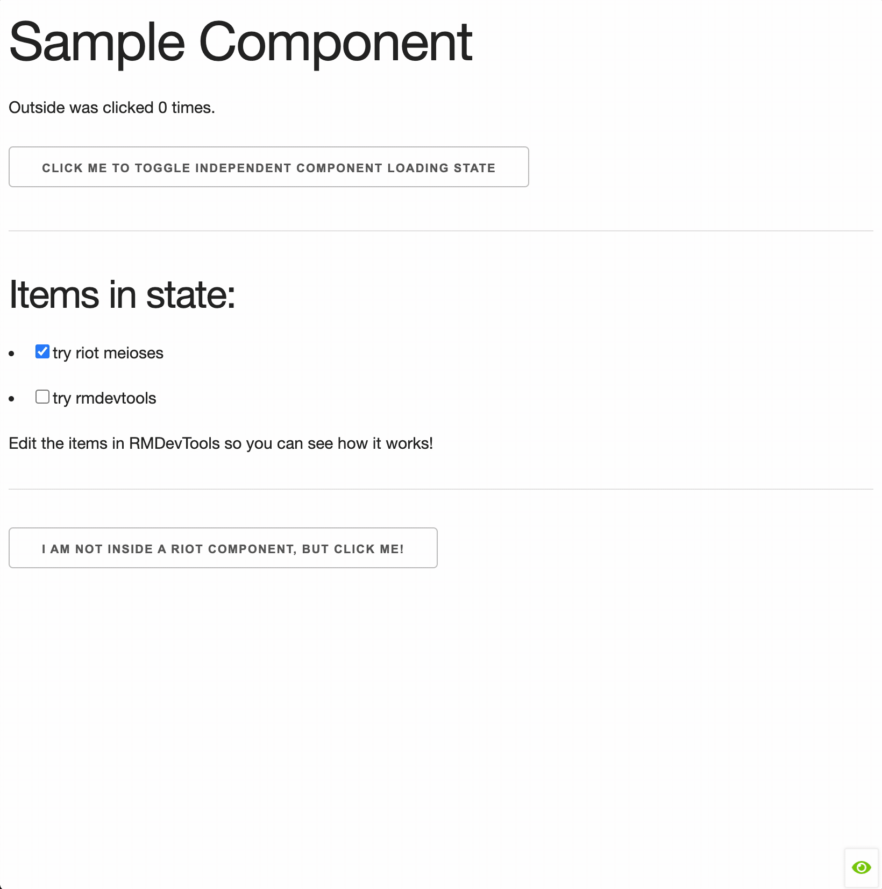

# Riot Meiosis

Meiosis state manager for Riot using Erre. [Learn more about meiosis](http://RiotMeiosis.js.org).

- [Riot Meiosis](#riot-meiosis)
  - [Usage](#usage)
  - [API](#api)
    - [`createStream(reducer, initialState)`](#createstreamreducer-initialstate)
    - [`connect(mapToState, mapToComponent)(MyComponent)`](#connectmaptostate-maptocomponentmycomponent)
    - [`update(newState)`](#updatenewstate)
    - [`getState()`](#getstate)
    - [`getStream()`](#getstream)
  - [RM Dev Tools](#rm-dev-tools)

Key things to note:
- Implements a stream to update state
- Comes with a `connect` function to wrap stream functionality
- Components attempt to update when stream is pushed to
- Prevent component updates if state has not changed
- Stream listeners are destroyed when `onBeforeUnmount`

## Usage

```
npm i --save riot-meiosis
```

```js
import {
    connect,
    getState,
    createStream,
    getStream,
} from 'riot-meiosis';

// Set your initial state.
// State is only mutable via manager API.
const state = {
    initial: true,
    isNew: true,
    mutable: false,
    nested: {
        hasCandy: true
    }
};

// Root state reducer
const reducer = (newState, oldState) => ({
    ...oldState,
    ...newState
});

// Create global application stream (can only run once)
const stream = createStream(reducer, stub.state);

// stream is simply an Erre stream
stream.push({
    initial: false,
    isNew: false
});

// Gets an immutable clone of the current state
console.log(getState());
// > {
//     initial: false,
//     isNew: false,
//     mutable: false,
//     nested: {
//         hasCandy: true
//     }
// }

```

In your `.riot` files:
```html

<myComponent>

    <p if={ hasCandy }>I have candy!</p>

    <script>

        import { connect } from 'riot-meiosis';
        import myActions from './actions';

        const mapToState = (appState, ownState, ownProps) => ({
            ...ownState,
            ...appState.nested
        });

        // Optional mapping of functions or objects to component
        const mapToComponent = myActions;
        // OR
        const mapToComponent = (ownProps, ownState) => myActions;

        const component = {

            onBeforeMount() {

                // connect will respect original onBeforeMount
                this.state = {
                    lala: true
                }
            }
        }

        export default connect(mapToState)(component);
        // OR
        export default connect(mapToState, mapToComponent)(component);
    </script>
</myComponent>
```

## API

```js
const {
    createStream,
    connect,
    update,
    getState,
    getStream,
    utils
} = 'riot-meiosis';
```


### `createStream(reducer, initialState)`

Simply put, this function returns an [Erre stream](https://github.com/GianlucaGuarini/erre#api) and sets your global application state. Both `stream` and `state` are only ever defined once, so you cannot run this function twice.

Both `reducer()` and `initialState` are required. You can set `initialState` to anything except `null` or `undefined`.

* `reducer` *function, required* - Reducer that transforms incoming payloads into global state
* `initialState` *any, required* - Initial app state. Can be set to anything except `null` or `undefined`.


### `connect(mapToState, mapToComponent)(MyComponent)`

Decorator for implement state management on a Riot component. Application state is mapped to Component state, stream updates generate component updates only when there are changes to the relevant state, and component cleans up and  stops listening to state changes `onBeforeUnmount`.

* `mapToState(appState, ownState, ownProps)` *function, required* - Function to reduce application state to relevant app state
* `mapToComponent`: Optional
    - *object* - Map an object to component
    - *function* - `(ownProps, ownState) => ({})` - Map a function's return value to component. Receives component props and state. Should return an object.

**Returns**

Function to pass your component into. The result value is used to `export default` inside your Riot component and have a component that is conditionally connected to global state.

### `update(newState)`

Pushes an update through your reducer. This is a helper for `getStream().push(newState)`


### `getState()`

Returns the application state.


### `getStream()`

Returns the application state stream.


## RM Dev Tools

Riot Meiosis comes with a dev tool to be able to look into your state and manipulate it directly.




In your `app.js`
```js
import { register, component } from 'riot';
import { getStream, connect, RMDevTools } from 'riot-meiosis';

// You must pass it connect and getStream in order
// for it to return a mountable riot component
register('rmdevtools', RMDevTools({ getStream, connect }))
```

In your `app.riot` or `index.html`
```html
<html>
    ...
    <footer></footer>

    <rmdevtools></rmdevtools>
</html>

```


If you're using riot in browser compile mode and place this in your `index.html`, you need to register and mount it on your compile callback:

```html

<rmdevtools></rmdevtools>

<script>
    (async function main() {
        await riot.compile();

        riot.mount('samplecomponent');

        await riot.register(
            'rmdevtools',
            RiotMeiosis.RMDevTools(RiotMeiosis)
        );

        riot.mount('rmdevtools');

        }())
</script>

```

> ### NOTE:
> `rmdevtools` by default has a 3 second debounce for pushing updates when in autoSave mode.
> This can be modified by adding `debounce=""` attribute to whatever you want it to be.
> ``` html
> <rmdevtools debounce="1000"></rmdevtools>
> ```
> Or if you want to disable it complete:
> ``` html
> <rmdevtools debounce="0"></rmdevtools>
> ```
> This is done to prevent blasting the stream with updates when typing, or doing modifying a large number of items, which can lead to performance issues if you're iterating over large collections or lists.